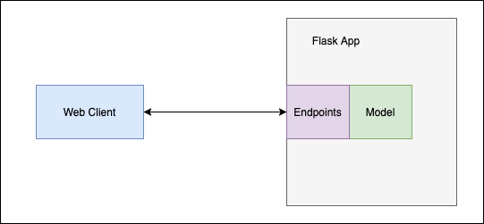

# Disaster Prediction Backend

*Winter 2020-21 - CSE3020 Data Visualization - J Component Project*

## Datasets

### [NASA Global Landslide Catalog](https://data.nasa.gov/Earth-Science/Global-Landslide-Catalog-Export/dd9e-wu2v)

The Global Landslide Catalog (GLC) was developed with the goal of identifying rainfall-triggered landslide events around the world, regardless of size, impacts or location. The GLC considers all types of mass movements triggered by rainfall, which have been reported in the media, disaster databases, scientific reports, or other sources. 

### [Earthquakes Dataset from USG Earthquakes Hazards Program](https://www.kaggle.com/farazrahman/earthquake)

This data set is taken from USGS(U.S Geological Survey). The USGS provides reliable scientific information to describe and understand the Earth; minimize loss of life and property from natural disasters; manage water, biological, energy, and mineral resources; and enhance and protect our quality of life.

It also monitors and reports on earthquakes, assesses earthquake impacts and hazards, and conducts targeted research on the causes and effects of earthquakes.

### [Sub Division Monthly Rainfall Dataset from IND GOV](https://data.gov.in/resources/sub-divisional-monthly-rainfall-1901-2017)

 Contains month wise all India rainfall data. The sub-division wise rainfall and its departure from normal for each month and season has been provided in the data. Released under NDSAP by ministry of earth sciences and department of meteorology.

## Purpose

Uses a simple random forest regression classifier on the above datasets to predict the future disaster levels. The model is used to compute and deliver the data via a Flask API.

This data is visualized with a ReactJS frontend with nivo charts [here](https://github.com/sanjitk7/landslide-mitigation-frontend).


## API Endpoints

1. Predict Rainfall with previous 2 months  - ***POST: /rainfallpred***
   - Sample Data to send: 
    ```
    {
        "first_month": 49.2,
        "second_month": 87.1,
        "third_month": 29.2
    }
    ```
   - Sample Output: 83.6824

2. Predict Fatality Rate given the following attributes - ***POST: /fatalitypred***
   - Sample Data to Send: 
    ```
    {
        "location_accuracy":"5km",
        "landslide_category": "mudslide",
        "landslide_trigger": "downpour",
        "landslide_size": "small",
        "landslide_setting": "unknown",
        "country_name": "United States",
        "admin_division_population": 36619.0,
        "longitude": -122.6630,
        "latitude": 45.4200
    }
    ```
   - Sample Output: [3.22222]

3. Predict magnitude of earthquake given the following attributes - ***POST: /magnitudepred***
   - Sample Data to Send:
    ```
    {
        "latitude": 33.262167,
        "longitude": -117.526000,	
        "rms": 0.17,
        "type": "earthquake",
        "status": "automatic",
        "locationSource": "ci",
        "magSource": "ci",
        "short place": "CA"
    }
    ```
    - Sample Output: 4.21223

